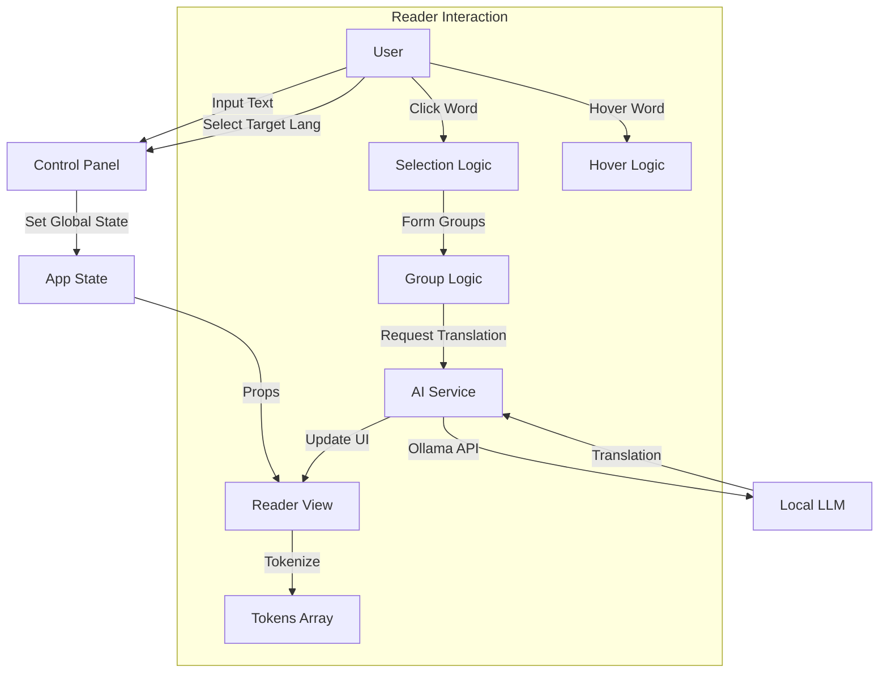
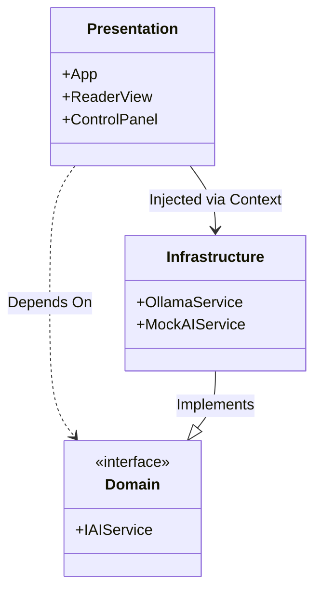

# Reader Helper

A premium reading assistant application built with React, TypeScript, and Ollama.

## 📖 Current Modifications (v1.1)

### Logic
The application core logic revolves around text tokenization and interaction.
1. **Input**: User pastes text or generates it via AI.
2. **Processing**: Text is split into tokens (words/whitespace), preserving structure.
3. **Interaction**:
    - **Click**: Users click words to add them to a selection set. Contiguous selections form groupings.
    - **Hover**: Users hover over words to get instant "dictionary-style" translations.
4. **Translation**:
    - **Context-Aware**: Translations use surrounding context (sentences) to ensure accuracy.
    - **Target Language**: Users select a target language (e.g., Spanish), and all AI prompts are tailored to this target.
    - **Provider**: Defaults to **Ollama** (Local LLM) for privacy and zero-cost, with a fallback Mock mode.

### Architecture
We follow **Clean Architecture** principles with a strict **Presentation-Domain-Infrastructure** separation.

- **Presentation Layer** (`src/presentation`):
    - **Components**: Pure UI elements (e.g., `ReaderView`, `ControlPanel`).
    - **State**: React Context (`ServiceContext`) handles dependency injection. `App.tsx` manages high-level application state (Source/Target languages).
- **Infrastructure Layer** (`src/infrastructure`):
    - **AI Services**: Concrete implementations of `IAIService`.
        - `OllamaService`: Connects to local Ollama instance.
- **Dependency Injection**: Services are injected via `ServiceContext`, allowing easy swapping (e.g., Mock vs. Live).

### Features
- **Clean, Premium UI**: Glassmorphism design, smooth transitions, distraction-free reading.
- **Unified Design System**: Built with **shadcn/ui** and **Tailwind CSS** for consistency and accessibility.
- **MCP Server Ready**: Configured for AI assistants (VS Code/Cursor) to browse and install components.
- **Local AI Integration**: Seamless connection to local Ollama models.
- **Smart Translation**: Hover and selection-based translations.
- **Language Controls**: Top-level source/target language selection.

### Source Tree
```
src/
├── core/                  # Interfaces & Models
│   └── interfaces/        # IAIService contract
├── infrastructure/        # External Communication
│   └── ai/                # OllamaService & MockAIService
├── presentation/          # UI Layer
│   ├── components/        # Shared components
│   ├── contexts/          # DI Container (ServiceContext)
│   ├── features/
│   │   ├── controls/      # ControlPanel (Input/Settings)
│   │   └── reader/        # ReaderView (Main reading area)
│   ├── App.tsx            # Root & Global State
│   └── main.tsx           # Entry Point
└── styles/                # Global CSS & Variables
```

### Diagrams

#### Core Logic Flow


#### Architecture Layers


## 🛠 Setup & Usage
1. **Prerequisites**: [Ollama](https://ollama.ai/) installed and running (`ollama serve`).
2. **Install**: `npm install`
3. **Run**: `npm run dev`
4. **Build**: `npm run build`
